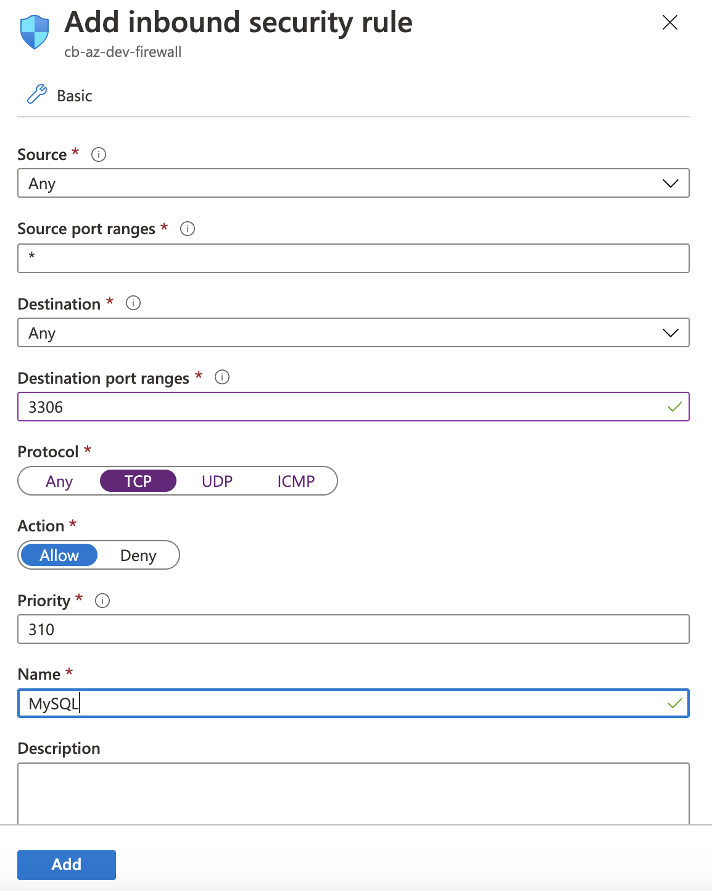

# Deploiement sur Azure

- [ ] [Créer et pointer vers la machine](https://github.com/CollegeBoreal/Tutoriels/tree/master/2.Virtualisation/4.Cloud/2.Public/2.Azure)

- [ ] Ouvrir le port :three::three::zero::six: sur le `Firewall`

</img>

- [ ] [Créer la base de données et se connecter](../2.DQL)

|:hash:| Boréal :id:                | Fait               | Azure |
|------|----------------------------|--------------------|-------|
| 1 | [300111441](../300111441/300111441.sql) | [:heavy_check_mark:] |
| 2 | [300111824](../300111824/300111824.sql) | [x] |
| 3 | [300115065](../300115065/300115065.sql) | [x] |
| 4 | [300115140](../300115140/300115140.sql) | :heavy_check_mark: |
| 5 | [300116670](../300116670/300116670.sql) | :heavy_check_mark: |
| 6 | [300116685](../300116685/300116685.sql) | [:x:] |
| 7 | [300116973](../300116973/300116973.sql) | [:x:] |
| 8 | [300117178](../300117178/300117178.sql) | [:x:] |
| 9 | [300117314](../300117314/300117314.sql) | [:x:] |
| 10 | [300117444](../300117444/300117444.sql) | [:heavy_check_mark:] |
| 11 | [300117782](../300117782/300117782.sql) | [:x:] | 
| 12 | [300117784](../300117784/300117784.sql) | :heavy_check_mark: |
| 13 | [300117806](../300117806/300117806.sql) | [:heavy_check_mark:] |
| 14 | [300118524](../300118524/300118524.sql) | [:heavy_check_mark:] |
