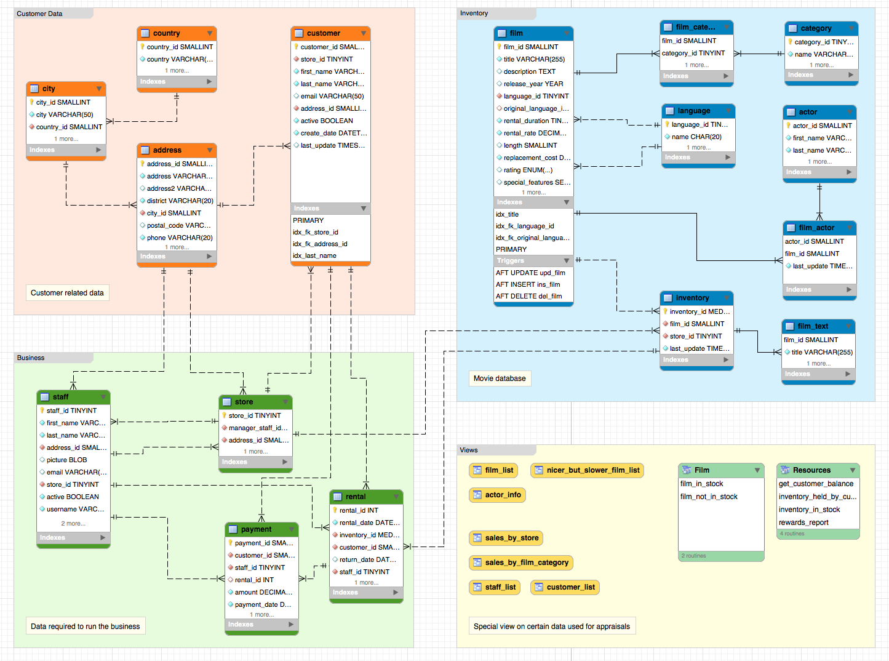

### Example de bases de données
http://dev.mysql.com/doc/index-other.html

- [x] Base de données `sakila-db`

* Télécharger le fichier `sakila-db.zip` dans le répertoire racine de l'utilisateur. (Home Directory ~ )

http://downloads.mysql.com/docs/sakila-db.zip

* Décompresser le fichier

```
$ unzip ~/Downloads/sakila-db.zip  -d ~/Downloads
```

- [x] Création de la base de données `sakila` dans `Docker`

:bulb: S'assurer que le conteneur `some-mysql` est créé

* Créer la base de données sakila

```
$ docker container exec --interactive --tty some-mysql \
              mysql --user root -ppassword --execute \
              "CREATE DATABASE sakila;"
```

* Créer un utilisateur

```
$ docker container exec --interactive some-mysql  \
              mysql --user root -ppassword --execute \
              "CREATE USER 'etudiants'@'%' IDENTIFIED BY 'etudiants_1';"
```

* Accorder tous les droits a l'utilisateur d'utiliser la base sakila

```
$ docker container exec --interactive some-mysql  \
              mysql --user root -ppassword --execute \
              "GRANT ALL ON sakila.* TO 'etudiants'@'%';"
```

- [x] Charger la base de données `sakila`

- Charger la structure de données (schema)


```
$ docker container exec  --interactive some-mysql \
               mysql --user root -ppassword sakila < ~/Downloads/sakila-db/sakila-schema.sql
```

- Charger les données

```
$ docker exec  --interactive some-mysql \
               mysql --user root -ppassword sakila < ~/Downloads/sakila-db/sakila-data.sql
```

### Se connecter à [MySQL WorkBench](https://www.mysql.com/fr/products/workbench/)

:m: Installer MySQL WorkBench

:computer: Windows

```
PS > choco install mysql.workbench
```
:apple: MacOS

```
% brew cask install mysqlworkbench
```

:m: Connection à MySQL Workbench

</img>

### Éxécuter les commandes [SQL](../S.SQLCommands) en se servant du modèle ci-dessous



## :bookmark: Devoir 

- [x] Créer un fichier :id:`.sql` dans votre répertoire :id:

- [x] Dans le fichier :id:`.sql` y mettre une requete SQL correspondant au modèle Sakila

# [Participation](.scripts/Participation.md)
