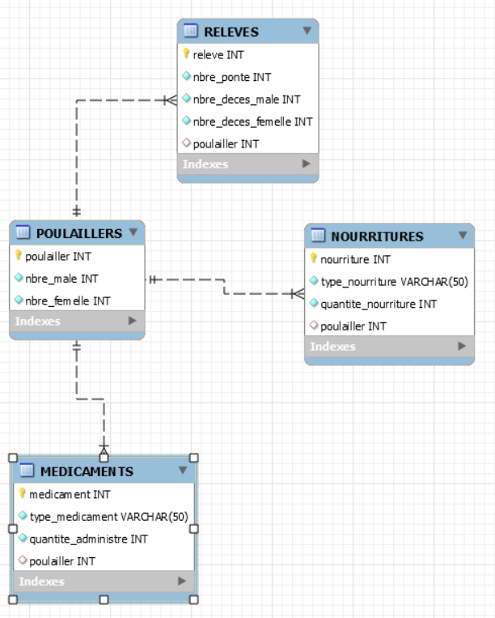

# mon domain

### EMPIRE_POUSSINNY

## :one: Description:
``Cette base de donnees represente une mini ferme qui eleve des poussins et la production des oeufs. Elle permet la gestion facile des medicaments, la nourriture et les releves.``

## :two: REVERSE ENGINEERING:
</img>

## :three: REQUESTES:

## :apple: Imprimez tous les Releves ensuite afficher nombre deces male

``SELECT* FROM RELEVES;``

``SELECT nbre_deces_male FROM RELEVES
