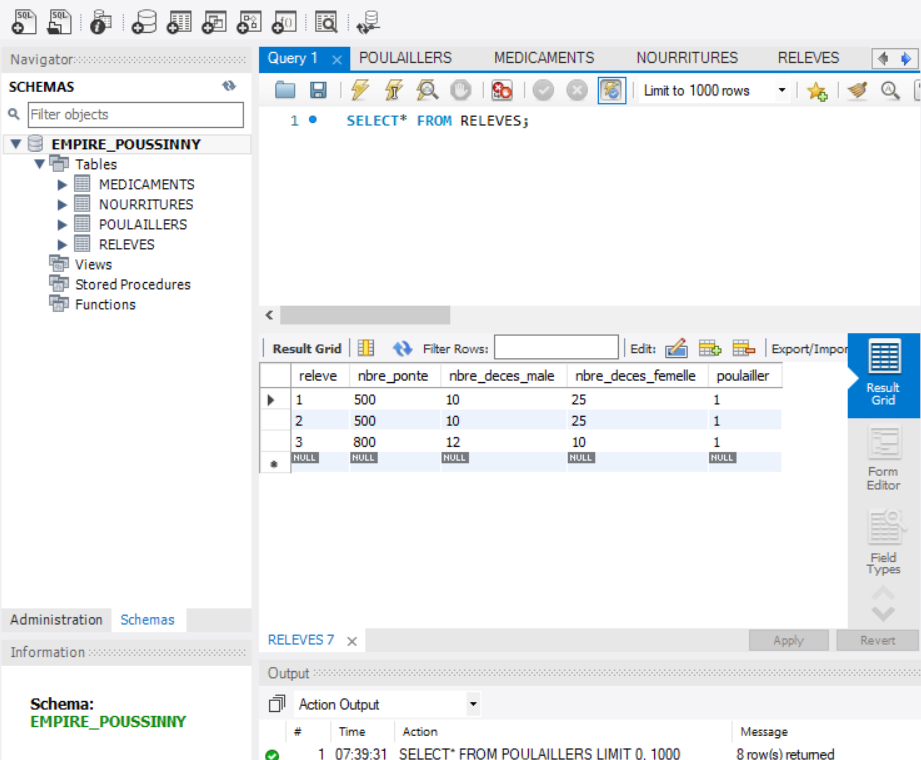
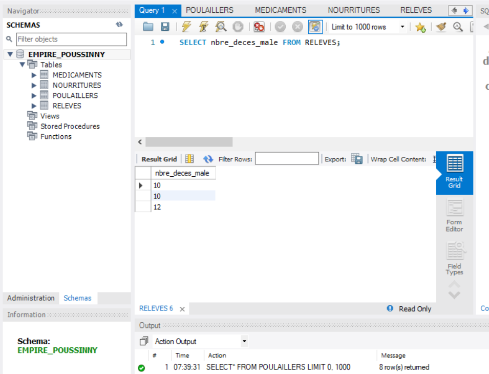

#  :chicken: :chicken: mon domain :chicken: :chicken:

### :chicken: EMPIRE_POUSSINNY :chicken:

## :one: :chicken: :chicken: Description: :chicken: :chicken:
``Cette base de donnees represente une mini ferme qui eleve des poussins et la production des oeufs. Elle facilite la gestion des medicaments, la nourriture et les releves.``

## :two: :chicken: REVERSE ENGINEERING :chicken:

</img>

## :three: REQUESTES :chicken:

## :chicken: Imprimez tous les Releves ensuite afficher nombre deces male :chicken:

``SELECT* FROM RELEVES;``

## :chicken:  :chicken: :chicken:  :chicken:  v

</img>

## :chicken: :chicken: :chicken: :chicken: :chicken: :chicken:

``SELECT nbre_deces_male FROM RELEVES``

## :chicken: :chicken:  :chicken:  :chicken:  :chicken:

</img>

## :chicken:                       :chicken:   
