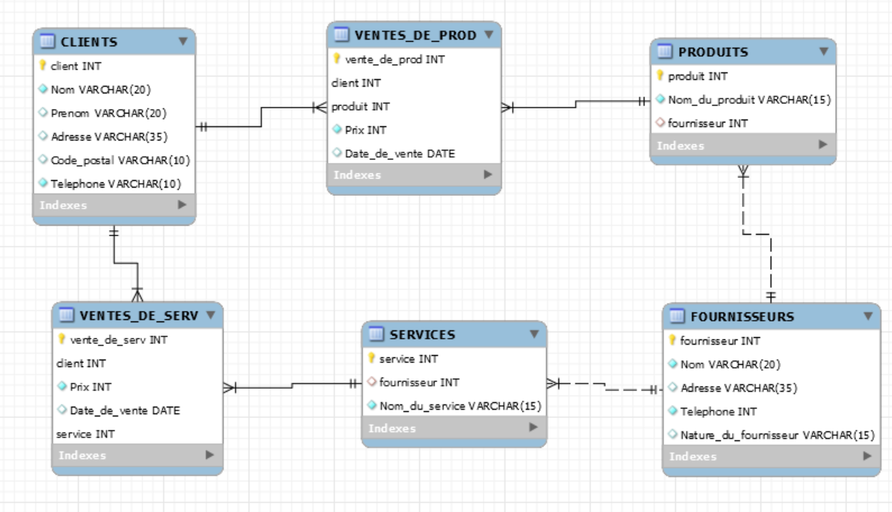

# ÊTRE BIEN: Base de données pour la vente en ligne de produits de santé et cosmétiques +vente de services de soins aux personnes


## Sommaire:

  1. Description
  2. Reverse Engineering
  3. Contraintes DDL: un exemple
  4. Requêtes liées aux rapports


## Description:

Cette base de données représente un magasin en ligne qui vend des produits et des services sur le site etrebien.com 
Nous enregistrons les ventes, les données des clients et informations des fournisseurs ainsi que les détails de la vente des services et des produits par catégorie.


:whale:

## Reverse Engineering:

Voici le schéma des relations entre tables selon le procédé Reverse Engineer:


 

## Exemple de contrainte DDL

Je fais une contrainte DDL sur la table VENTES_DE_PROD en utilisant CONSTRAINT et la fonction UNIQUE:

```
CREATE TABLE VENTES_DE_PROD (  
  vente_de_prod INT AUTO_INCREMENT,  
  client INT,  
  produit INT,  
  Prix INT NOT NULL,  
  Date_de_vente DATE UNIQUE,  
  PRIMARY KEY(vente_de_prod, client, produit),  
  CONSTRAINT uc_client_produit UNIQUE (client, produit),  
  FOREIGN KEY(client)  
     REFERENCES CLIENTS(client),  
  FOREIGN KEY(produit)  
     REFERENCES PRODUITS(produit)  
  );  
 ```

## Requêtes liées aux rapports:

**1. Séléctionner tous les clients qui ont achetés des produits au moins de septembre 2020, leur nom, et le nombre de produits achetés par client:**

```
SELECT PRODUITS.produit, VENTES_DE_PROD.Date_de_vente, CLIENTS.Nom, SUM(VENTES_DE_PROD.client) FROM PRODUITS  
JOIN VENTES_DE_PROD USING (produit)  
JOIN CLIENTS USING (client)  
GROUP BY PRODUITS.produit, VENTES_DE_PROD.Date_de_vente, CLIENTS.Nom;  
```

Résultat:


**2. Séléctionner tous les cliens qui ont achetés un service entre janvier et septembre 2020. A chaque fois, nous aimerions savoir quel fournisseur à fournit le service en question** (pour des raisons évidentes d'exercice, le rendu serait symbolique et limité seulement au nombre restreint et limité des entrées dans le fichier data)

```
SELECT CLIENTS.Nom, CLIENTS.Prenom, Nom_du_service, FOURNISSEURS.Nom FROM CLIENTS  
JOIN VENTES_DE_SERV USING (client)  
JOIN SERVICES USING (service)  
JOIN FOURNISSEURS USING (fournisseur)  
WHERE VENTES_DE_SERV.Date_de_vente between "2020/01/01" and "2020/09/01"  
GROUP BY CLIENTS.Nom, CLIENTS.Prenom, FOURNISSEURS.Nom, SERVICES.Nom_du_service  
LIMIT 0,10;  
```

Résultat:  


