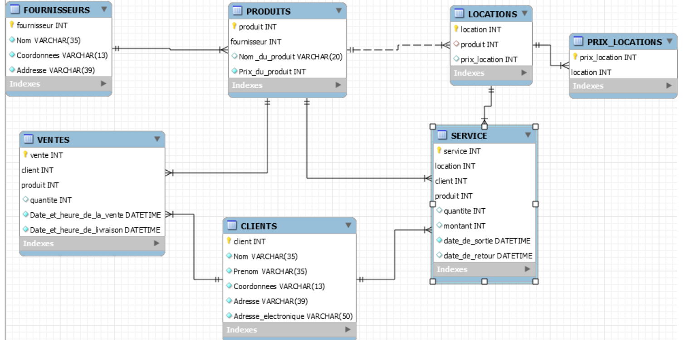

 # MOTOSPORT
 
:zap: MOTOSPORT :zap: est une société qui fournit des services:

:pushpin: de ventes et location d'automobiles 

 ## Modelisation de la base de données
 

## RAPPORTS ET REQUETES

:star: Afficher le noms des clients avec leurs achats 
:star: Afficher le produit qui a été le plus vendu
:star: Afficher les produits qui ont été le plus acheter ou louer après 2020-03-31 %
:star: Imprimer le nom et le montant de la facture totale des clients ayant louer le 2020-12-29 12:30:00 

-- Afficher le noms des clients avec leurs achats 

-- Imprimer le nom et le montant de la facture totale des clients ayant louer le 2020-12-29 12:30:00 

    SELECT CLIENTS.nom, SUM(SERVICE.montant) As facture_totale, PRODUITS.nom_du_produit 
    FROM CLIENTS
     JOIN SERVICE USING (client)
     JOIN LOCATIONS USING (produit)
     JOIN PRODUITS USING (produit)
     WHERE date_de_sortie = "2020-12-29 12:30:00 "
     GROUP BY CLIENTS.nom, PRODUITS.nom_du_produit ;
     
     SELECT CLIENTS.nom, SUM(SERVICE.montant) As facture_totale 
     FROM CLIENTS
     JOIN SERVICE USING (client)
     WHERE date_de_sortie = "2020-12-29 12:30:00 "
     GROUP BY CLIENTS.nom;
