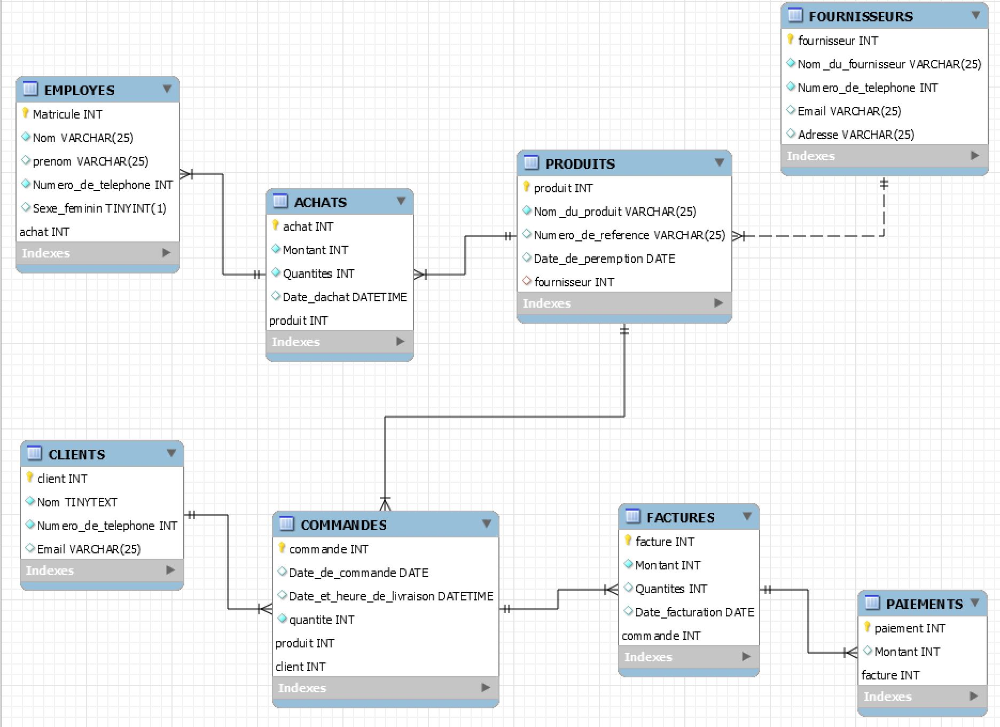
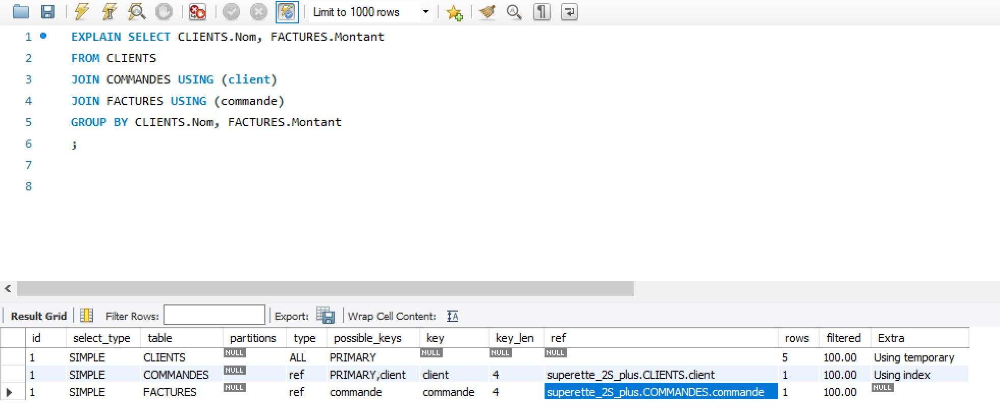
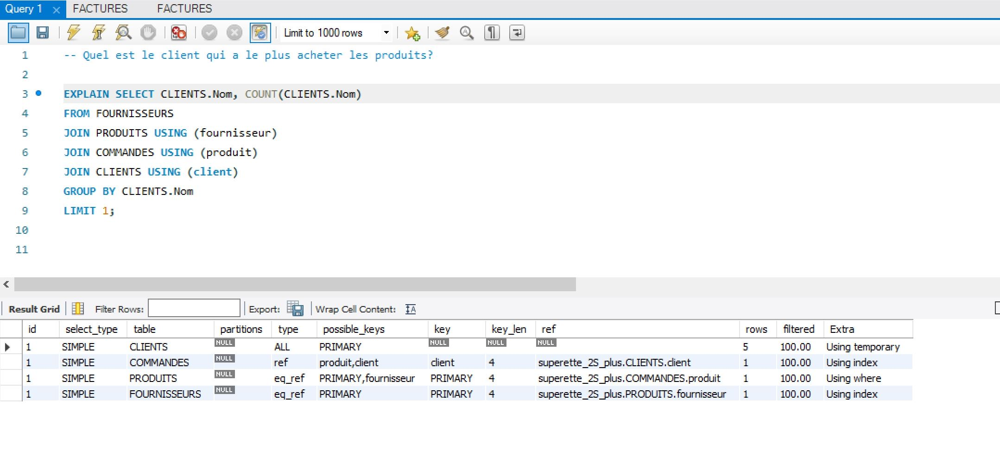
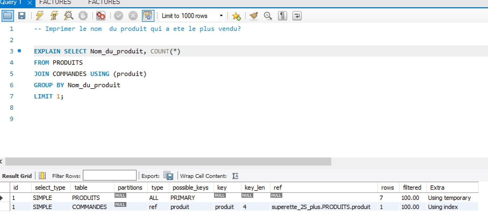
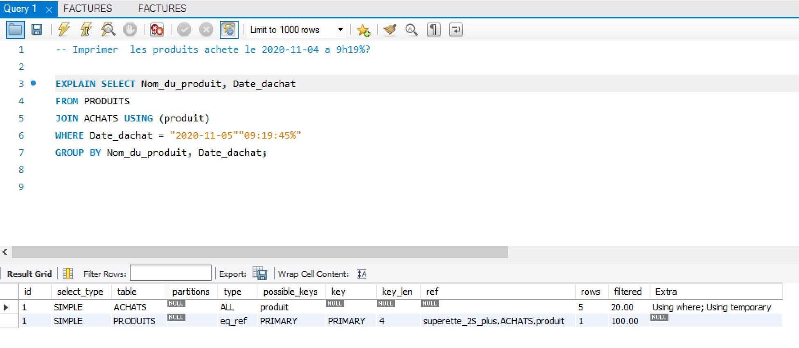
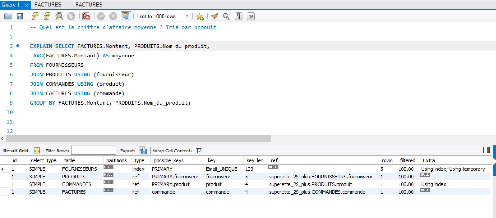
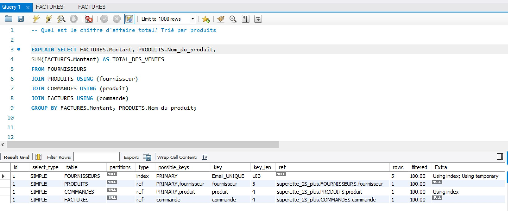

 # :green_heart: superette_2S_plus :green_heart:

:zap: La superette_2S_plus est specialisee:

:white_check_mark: Dans la vente et l'achat des marchandises en details
:white_check_mark: Dans la buvettes

 ## :green_heart: Representation de notre base de donnee
 




## :green_heart: Rapports

:ok_hand: Imprimer le nom et le montant des factures des clients ?

:ok_hand: Quel est le client qui a le plus acheter les produits?

:ok_hand: Imprimer le nom  du produit qui a ete le plus vendu?

:ok_hand: Imprimer  les produits achete le 2020-11-04 a 9h19%?

:ok_hand: Quel est le chiffre d'affaire moyenne ? Trié par produit

:ok_hand: Quel est le chiffre d'affaire total ? trie par produit


## :green_heart: requettes


```

-- IMPRIMER le nom et le montant des factures des clients ?

SELECT CLIENTS.Nom, FACTURES.Montant
FROM CLIENTS
JOIN COMMANDES USING (client)
JOIN FACTURES USING (commande)
GROUP BY CLIENTS.Nom, FACTURES.Montant
;

-- Quel est le client qui a le plus acheter les produits?

SELECT CLIENTS.Nom, COUNT(CLIENTS.Nom)
FROM FOURNISSEURS
JOIN PRODUITS USING (fournisseur)
JOIN COMMANDES USING (produit)
JOIN CLIENTS USING (client)
GROUP BY CLIENTS.Nom
LIMIT 1;


-- Imprimer le nom  du produit qui a ete le plus vendu?

SELECT Nom_du_produit, COUNT(*)
FROM PRODUITS
JOIN COMMANDES USING (produit)
GROUP BY Nom_du_produit
LIMIT 1;

-- Imprimer  les produits achete le 2020-11-04 a 9h19%?

SELECT Nom_du_produit, Date_dachat
FROM PRODUITS
JOIN ACHATS USING (produit)
WHERE Date_dachat = "2020-11-05""09:19:45%" 
GROUP BY Nom_du_produit, Date_dachat;

-- Quel est le chiffre d'affaire moyenne ? Trié par produit

SELECT FACTURES.Montant, PRODUITS.Nom_du_produit,
 AVG(FACTURES.Montant) AS moyenne
FROM FOURNISSEURS
JOIN PRODUITS USING (fournisseur)
JOIN COMMANDES USING (produit)
JOIN FACTURES USING (commande)
GROUP BY FACTURES.Montant, PRODUITS.Nom_du_produit;


-- Quel est le chiffre d'affaire total? Trié par produits

SELECT FACTURES.Montant, PRODUITS.Nom_du_produit,
SUM(FACTURES.Montant) AS TOTAL_DES_VENTES
FROM FOURNISSEURS
JOIN PRODUITS USING (fournisseur)
JOIN COMMANDES USING (produit)
JOIN FACTURES USING (commande)
GROUP BY FACTURES.Montant, PRODUITS.Nom_du_produit;

```

## :green_heart: EXPLAIN des differents requetes:













