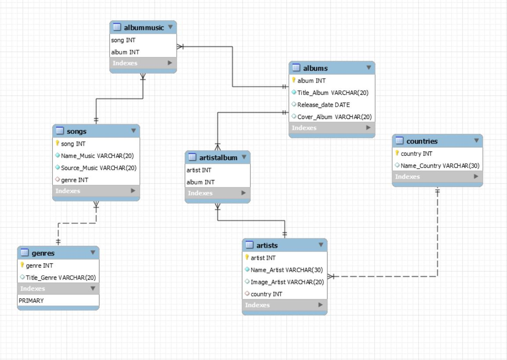
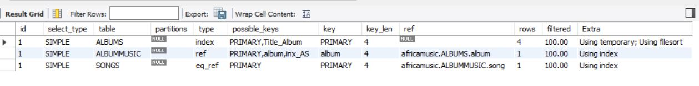
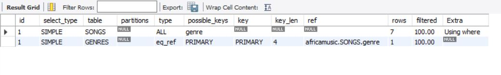
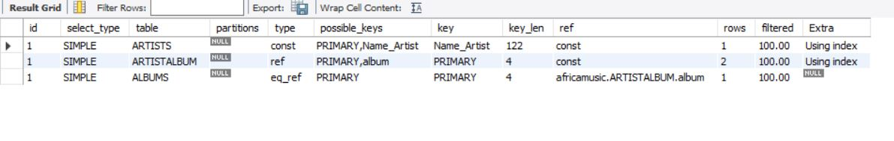
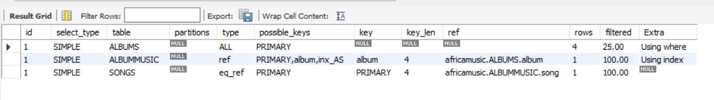

#  :a: AfricaMusic 
```{r setup, include=FALSE}
Gestion des musisc des artist africains 
```
## :rocket: MCD
--------------------------------------------------
</img>
```{r}
```
## :rocket: Requete
--------------------------------------------------
### 1. L'ALBUM QUI A LE PLUS DE SONG
```{r}
-- L'ALBUM QUI A LE PLUS DE SONG

SELECT Title_Album, COUNT(song) AS NB_SONG FROM ALBUMS JOIN ALBUMMUSIC USING(album)
JOIN SONGS USING(song)
GROUP BY ALBUM 
ORDER by NB_SONG DESC
LIMIT 1;
```

### 2. AFFICHER TOUTE LES MUSIC PAR GENRE
```{r}
-- AFFICHER TOUTE LES MUSIC PAR GENRE

SELECT Name_Music,Title_Genre FROM SONGS JOIN GENRES USING(genre);

```

### 3. TOUT LES ALBUMS DE L'ARTIST "KOFFI OLIMIDE"
```{r}
-- TOUT LES ALBUMS DE L'ARTIST "KOFFI OLIMIDE"

SELECT Name_Artist,Title_Album FROM ALBUMS JOIN ARTISTALBUM
USING(album) JOIN ARTISTS USING(artist) WHERE Name_Artist="KOFFI OLIMIDE";

```


### 4. TOUTES LES MUSICS DE L'ANNEE 2015
```{r}
-- TOUTES LES MUSICS DE L'ANNEE 2015

SELECT Name_Music FROM ALBUMS JOIN ALBUMMUSIC USING(album)
JOIN SONGS USING(song) WHERE Release_date BETWEEN '2015-00-00' AND  '2015-12-31';

```
-------------------------------------------------
## :rocket: Explain
--------------------------------------------------

#### 1. EXPLAIN SELECT Title_Album, COUNT(song) AS NB_SONG FROM ALBUMS JOIN ALBUMMUSIC USING(album) JOIN SONGS USING(song) GROUP BY ALBUM ORDER by NB_SONG DESC LIMIT 1;



L'ALBUM QUI A LE PLUS DE SONG


#### 2. EXPLAIN SELECT Name_Music,Title_Genre FROM SONGS JOIN GENRES USING(genre);


AFFICHER TOUTE LES MUSIC PAR GENRE

#### 3. EXPLAIN SELECT Name_Artist,Title_Album FROM ALBUMS JOIN ARTISTALBUM USING(album) JOIN ARTISTS USING(artist) WHERE Name_Artist="KOFFI OLIMIDE";


TOUT LES ALBUMS DE L'ARTIST "KOFFI OLIMIDE"


#### 4. SELECT Name_Music FROM ALBUMS JOIN ALBUMMUSIC USING(album) JOIN SONGS USING(song) WHERE Release_date BETWEEN '2015-00-00' AND  '2015-12-31';



TOUTES LES MUSICS DE L'ANNEE 2015


