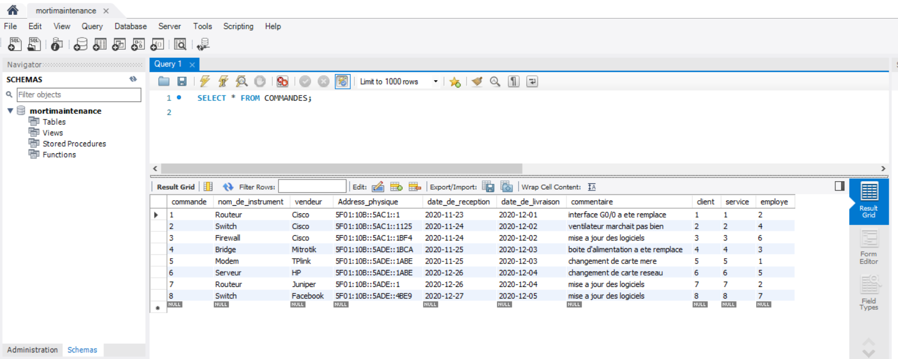

# :zap: Mortimaintenance est une compagnie qui fournit les maintenances des équipements techniques:zap:

:star: la base de données de cette compagnie est basée sur 5 tables reliées, dans lesquelles on sauvegarde des informations concernant ses employés, ses clients, ses départements, ses services offerts et les commandes faites par cette compagnie. 

## :zap: Le schéma des relatiosn dans la base de données :zap:

#  :pushpin: la politique de la compagnie concernant ses données:

## :one: L'adresse-email et numéro de téléphone de chaque employé doivent être uniques:     

##  :two: la personne en charge de chaque département soit unique:

##  :three: L'adresse-email de chaque client soit unique:

##  :four: le moment où on supprime un client de la table CLIENTS, on n'aura plus ses informations dans les autres tables reliées :

## :pushpin::star:For example, si l'on supprime le client numéro 1, on n'aura plus ses information dans la table COMMANDES:

## :ok_hand:

## :ok_hand:

## :ok_hand:

## :white_check_mark:

## :white_check_mark:
