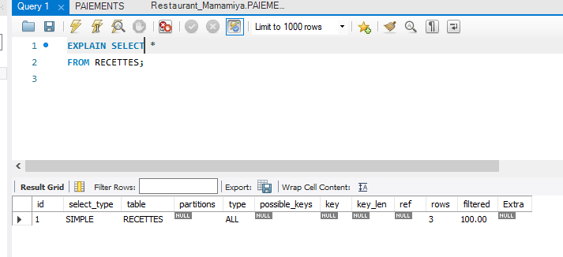
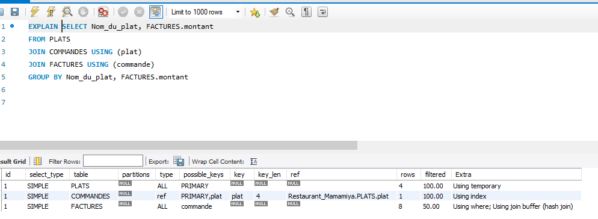

# :fork_and_knife: :stew: Restaurant Mamamiya
---

:spaghetti: Cette base de données  représente le Restaurant Mamamiya qui  propose des plats de nourritures variées à different prix 

 ## :tropical_drink: Reverce ingeniering 
 
 


## :strawberry: Contrainte DDL 

:heavy_check_mark: Contrainte sur la table RECETTES

```
CREATE TABLE RECETTES (
  recette INT NOT NULL AUTO_INCREMENT,
  Nom_de_la_recette VARCHAR(25) NOT NULL,
  ingredient INT NOT NULL,
  PRIMARY KEY (recette, ingredient),
  CONSTRAINT RECETTES_ibfk_1
  FOREIGN KEY (ingredient) REFERENCES INGREDIENTS (ingredient)
);

```

:heavy_check_mark: Contrainte sur la table PAIEMENTS

```

CREATE TABLE PAIEMENTS (
  paiement INT NOT NULL,
  montant FLOAT NULL DEFAULT NULL,
  Date_et_heure_de_Paiement DATETIME NOT NULL,
  facture INT NULL DEFAULT NULL,
  commande INT NULL DEFAULT NULL,
  CONSTRAINT PAIEMENTS_ibfk_1
  FOREIGN KEY (facture) REFERENCES FACTURES (facture)
);

```

## :watermelon: Requête 

:heavy_check_mark: Afficher la recette

```
SELECT * 
FROM RECETTES;
```

:heavy_check_mark: Chiffre d'affaire par plats

```
SELECT Nom_du_plat, FACTURES.montant
FROM PLATS
JOIN COMMANDES USING (plat)
JOIN FACTURES USING (commande)
GROUP BY Nom_du_plat, FACTURES.montant
```

## :rice: Explains

:heavy_check_mark: Afficher la recette




:heavy_check_mark: Chiffre d'affaire par plats




