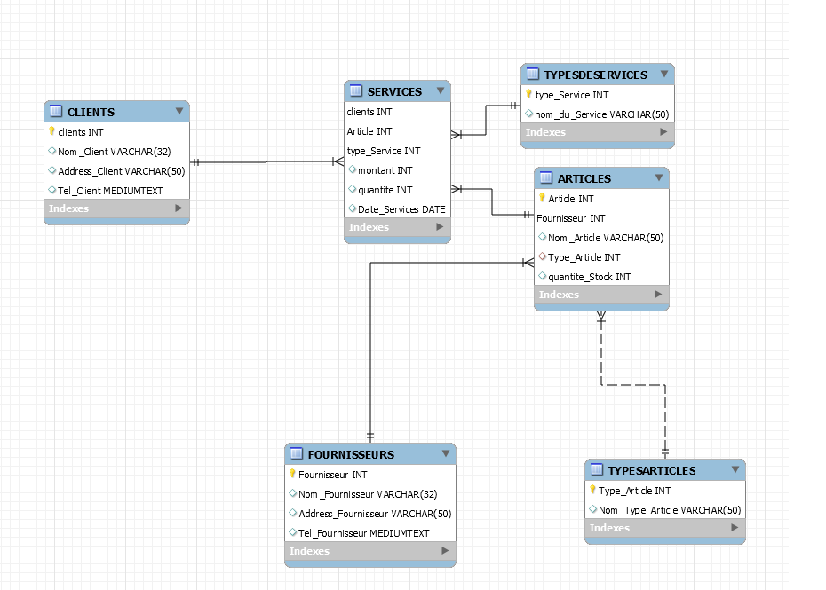

# :pushpin: BMOlineGaming 
</img> 
---
# :cop: CONTRAINTE TABLE ARTICLES
```
Article INT AUTO_INCREMENT,
Fournisseur INT,
Nom_Article varchar (50),
Type_Article INT,
quantite_Stock INT,
foreign key(Type_Article) references TYPESARTICLES (Type_Article),
foreign key(Fournisseur) references FOURNISSEURS (Fournisseur),
primary key(Article,Fournisseur),
CONSTRAINT quantite_nonzero CHECK(quantite_Stock<>0)

```

# :pushpin: RAPPORTS
--- 
### 1. :bell:Afficher la somme de tous les articles vendu

```
SELECT (montant * quantite) As sommetotal,Nom_Article FROM SERVICES join CLIENTS 
USING (clients) join ARTICLES USING (Article) 
join TYPESARTICLES USING (type_Article)
where Type_Article=1;

```
