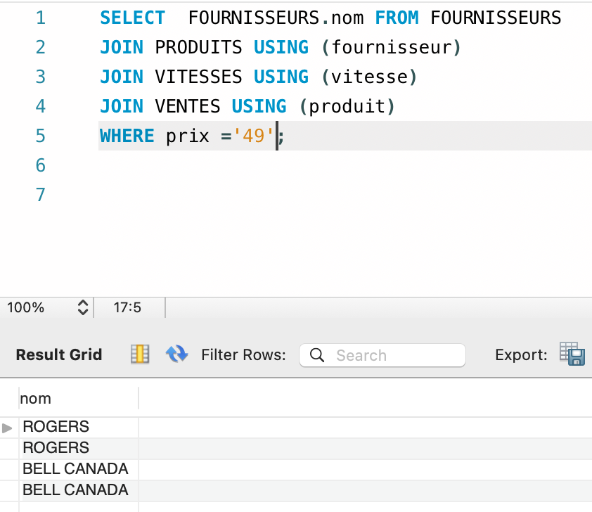

# REVERSE 

:three: RAPPORT

- Mes rapports
  - (1) 
    - Imprimer tous les clients
  
  
  - (2)
  
    - afficher le nom, prenom, des clients de la zone 1 ou zone d'Alberta
    
  - (3)
  
    - afficher tous les noms des fournisseurs et leurs numéro de téléphone qui ont des prix égale à 49
    
  - (4) 
  
    - Imprimer le nombre de vente de la compagnie

:four: requêtes

- Mes requêtes

  - (1)
  
    - SELECT  * FROM CLIENTS;
  
  - (2)
  
    - SELECT  CLIENTS.nom, CLIENTS.prenom, ZONES.ville FROM ZONES
    
    JOIN CLIENTS USING (zone)
    
    WHERE zone = '1'
    
  - (3)
  
    - 
    
  - (4)
  
    - SELECT  COUNT(vente)  FROM VENTES;
    

 

:six: PERFORMANCES

- EXPLAIN

