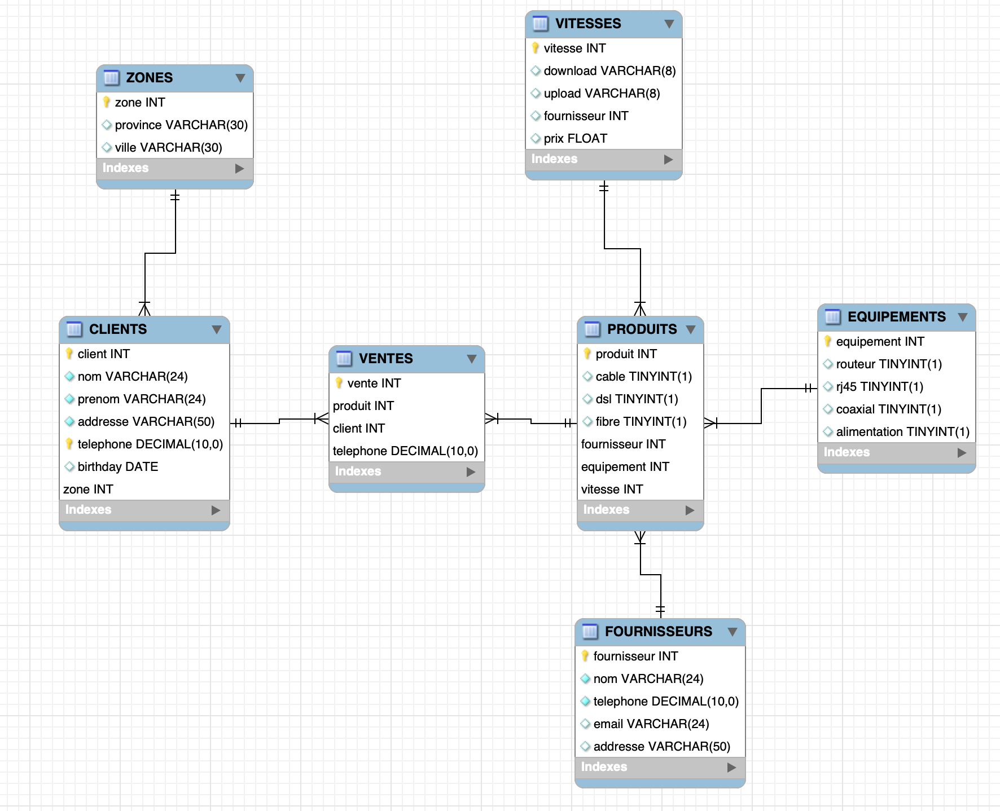

# REVERSE 

:three: RAPPORT

- Mes rapports
  - (1) 
  
  
  - (2)
  
  - Imprimer tous les clients
  
  - afficher le nom, prenom, des clients de la zone 1 ou zone d'Alberta

:four: requêtes

- Mes requêtes

  - (1)
  
  - SELECT  * FROM CLIENTS;
  
  - (2)
  
  - SELECT  CLIENTS.nom, CLIENTS.prenom, ZONES.ville FROM ZONES
JOIN CLIENTS USING (zone)
WHERE zone = '1'
 

:six: PERFORMANCES

- EXPLAIN

