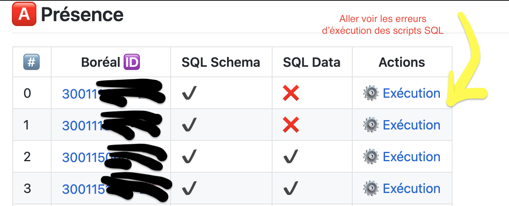
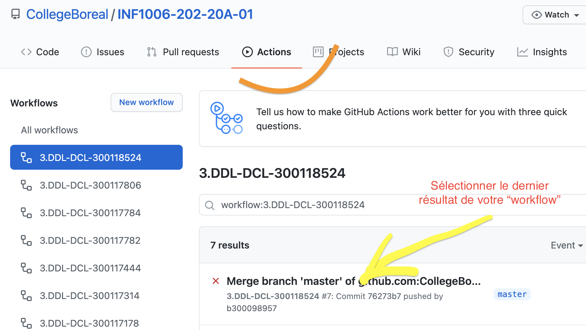
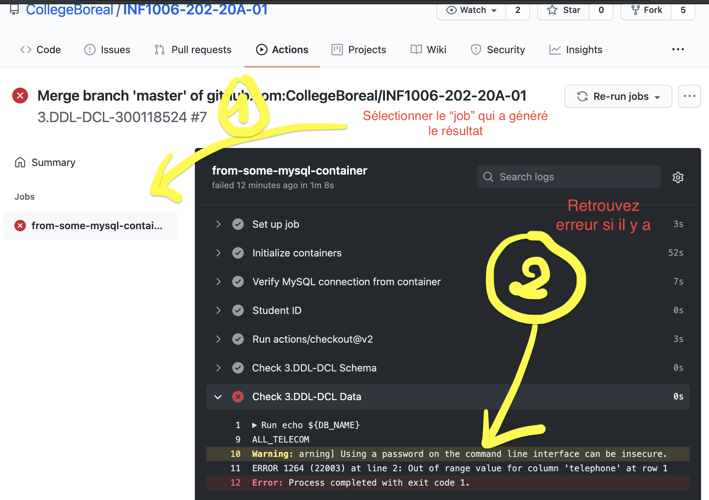

# 3 - DDL-DCL

## :o: Leçon

Pour ce cours, suivre:

- [ ]  la [lesson](documentation/Lesson.md) suivante

- [ ]  les [contraintes](../C.Constraints) 

## :a: Charger la base

Pour charger et tester votre base de données automatiquement, utilisez l'exemple de commandes ci-dessous

- [ ] Charger le schema

```
$ docker container exec  --interactive some-mysql mysql --user root --password=password  < \
                   ~/Developer/INF1006-202-20A-01/3.DDL-DCL/300116670/300116670-schema.sql 
```

- [ ] Charger les données, `BMOnlineGaming` étant le nom de la base de données à utiliser.

```
$ docker container exec  --interactive some-mysql mysql --user root --password=password   BMOnlineGaming < \
                   ~/Developer/INF1006-202-20A-01/3.DDL-DCL/300116670/300116670-data.sql 
```

## :b: [Participation](.scripts/Participation.md)

Pour vérifier votre [`participation`](.scripts/Participation.md) et les erreurs qui pourraient se cacher, suivez les images ci-dessous représantant la notation automatique avec `github actions`

| :one: [Participation](.scripts/Participation.md) | :two: Résultat | :three: Erreurs |
|---------------------|----------------|-----------------|
| </img> | </img> | </img> |

## :ab: [:construction:](documentation) Vérification 

  - [ ] Liste de vérification pour construire le modéle: 
  
   [:construction: liste de vérification](documentation)

