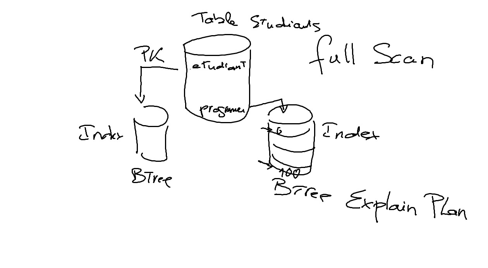
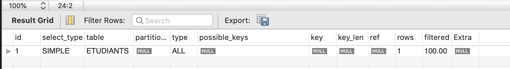
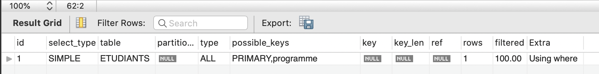

# Constraints

## :one: Constraints

#### :m: Relationship Constraints

:pushpin: [Foreign Key](https://dev.mysql.com/doc/refman/8.0/en/create-table-foreign-keys.html#foreign-key-examples)

```sql
mysql> SHOW CREATE TABLE VILLES;
*************************** 1. row ***************************
       Table: VILLES
Create Table: CREATE TABLE `VILLES` (
  `ville` int DEFAULT NULL,
  `pays` int DEFAULT NULL,
  INDEX `pay_ind` (`pays`),
  CONSTRAINT `ville_ibfk_1` 
     FOREIGN KEY (`pays`) REFERENCES `PAYS` (`pays`) 
     ON DELETE CASCADE
) ENGINE=InnoDB DEFAULT CHARSET=utf8mb4 COLLATE=utf8mb4_0900_ai_ci
```

## :two: Data Quality Constraints

:pushpin: [Check](https://dev.mysql.com/doc/refman/8.0/en/create-table-check-constraints.html)

```sql
mysql> CREATE TABLE t1 (
  c1 INT CHECK (c1 > 10),
  CONSTRAINT c1_nonzero CHECK (c1 <> 0)
);
```

:pushpin: [unique](http://www.mysqltutorial.org/mysql-unique-constraint/)

```sql
mysql> CREATE TABLE `ETUDIANTS` (
  `etudiant` INT NOT NULL AUTO_INCREMENT,
  `prenom` VARCHAR(45) NOT NULL,
  `nom` VARCHAR(45) NOT NULL,
  `email` VARCHAR(45) NOT NULL,
  PRIMARY KEY (`etudiant`),
  UNIQUE INDEX `email_UNIQUE` (`email` ASC)
);
```

# :three: Explain

```
Explain sert à montrer le chemin pris par la recherche de données.

Le but étant de trouver la meilleure route pour accélérer le retour des données

Activer un index indique une meilleur performance
```



:pushpin: Sans utiliser un index

```sql
mysql> EXPLAIN SELECT * from ETUDIANTS;
```



:pushpin: Utilise deux indexes (i.e. possible keys)

```sql
mysql> EXPLAIN SELECT * from ETUDIANTS WHERE programme > 1 OR etudiant = 1;
```



